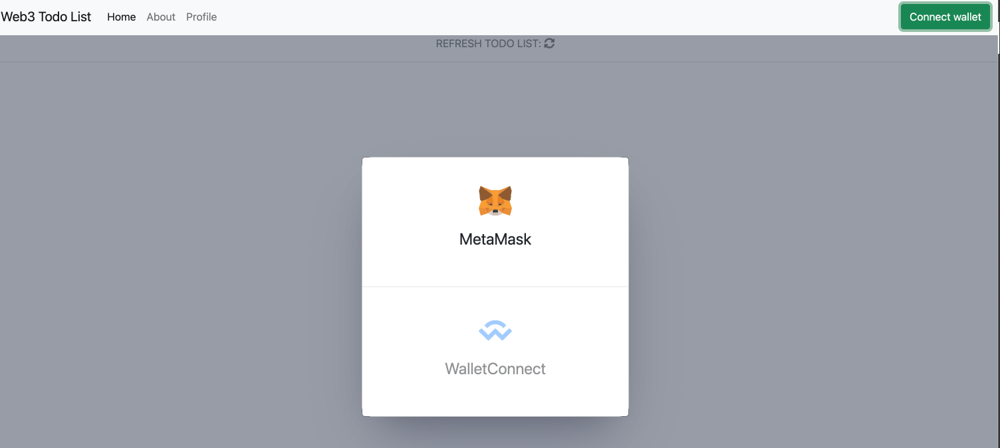
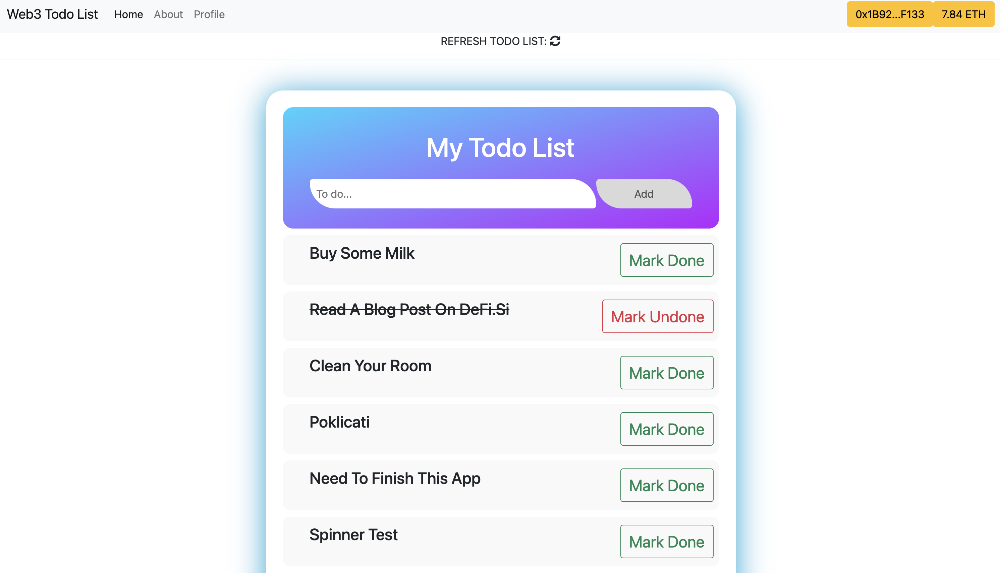

# Todo List

`Web3 Dapp Project`

[Link to <ins>Smart Contract</ins> used in project](https://mumbai.polygonscan.com/address/0x5269d63d6d2c25ba95ae2cb9fd5b46f1e48635a8)

## <ins>How does it work</ins>

- First you need to connect your wallet
- You have to be connected to `Mumbai Testnet`
- When you add task, it will ask you to `confirm` transaction (otherwise it won't work)
- When you finnish task, you press button `Mark done`, or if you change your mind, `Mark Undone`

> First you connect your wallet


<br>

> Then you can start using app



<hr>

## Github pages setup for typescript projects

- add this line to vite.config.ts: `base: process.env.NODE_ENV === "production" ? "/todo-list/" : "/",`
- add alias to home route like this: `alias: '/todo-list'`
- make sure you have: `.github/workflows/main.yml`
- on github go to Settings / Pages and select gh-pages branch

## Quickstart

```bash
npm install
npm run dev
```

## Features

- [Vue 3](https://v3.vuejs.org/guide/introduction.html#what-is-vue-js) as the foundation
- [Bootstrap](https://getbootstrap.com) for styling
- [Vite](https://vitejs.dev/guide/) for faster builds
- [ethers.js](https://docs.ethers.io/v5/) for interacting with Ethereum
- [vue-dapp](https://github.com/chnejohnson/vue-dapp) for the wallet connect

## Strict TypeScript disabled

In `tsconfig.json` the `strict` field is set to false, which means you can use plain JS in
the project.

## Recommended IDE Setup

- [VSCode](https://code.visualstudio.com/) + [Volar](https://marketplace.visualstudio.com/items?itemName=johnsoncodehk.volar)
